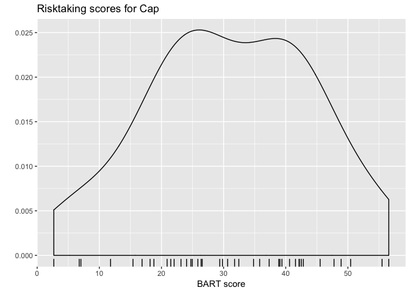
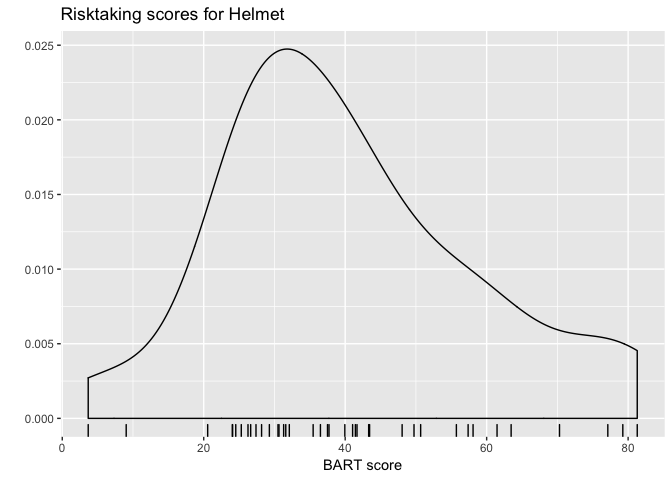
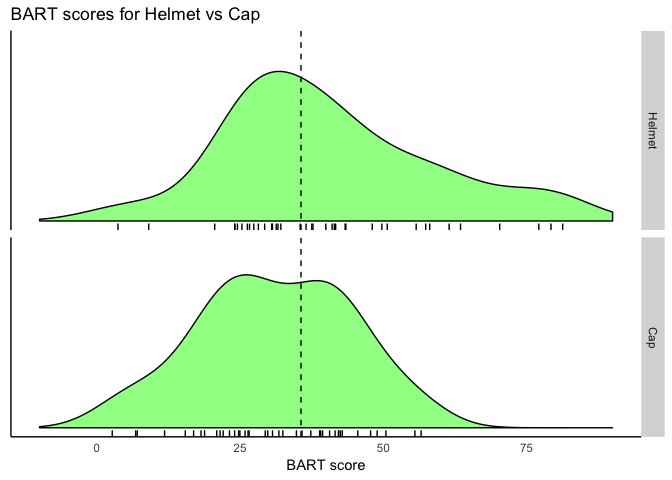
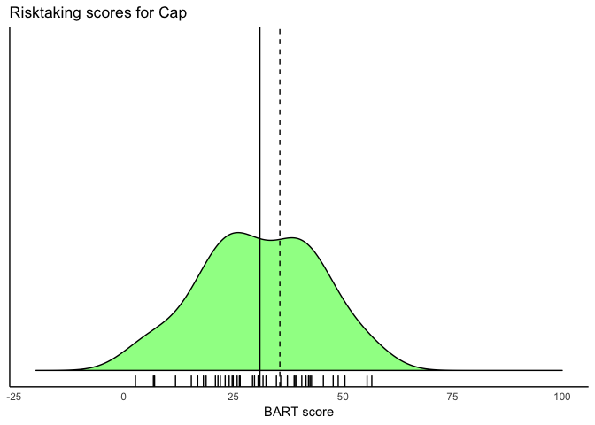

hw\_01
================
Abby Bergman
1/8/2019

``` r
#load packages
library(tidyverse)
```

    ## ── Attaching packages ────────────────────────── tidyverse 1.2.1 ──

    ## ✔ ggplot2 3.1.0     ✔ purrr   0.2.5
    ## ✔ tibble  1.4.2     ✔ dplyr   0.7.7
    ## ✔ tidyr   0.8.2     ✔ stringr 1.3.1
    ## ✔ readr   1.1.1     ✔ forcats 0.3.0

    ## ── Conflicts ───────────────────────────── tidyverse_conflicts() ──
    ## ✖ dplyr::filter() masks stats::filter()
    ## ✖ dplyr::lag()    masks stats::lag()

``` r
library(dplyr)
library(ggplot2)
```

``` r
#set wd
setwd("/Users/AbigailBergman/Desktop/Grad School/Winter Quarter 2019/Data Science/datascience_repo/week_01/hw_01")

#import data
bicycle <- read.csv("Bicycle.csv")
View(bicycle)
```

``` r
#Risk taking scores
helmet <- bicycle %>%
  filter(Condition ==1)

hat <- bicycle %>%
  filter(Condition == 2)

#BART
mean(helmet$BART)
```

    ## [1] 40.40308

``` r
sd(helmet$BART)
```

    ## [1] 18.17778

``` r
mean(hat$BART)  
```

    ## [1] 31.06341

``` r
sd(hat$BART)
```

    ## [1] 13.29115

``` r
var(helmet$BART)
```

    ## [1] 330.4318

``` r
var(hat$BART) #I am confused becasue these variances are not equal but the researchers assumed equal var?
```

    ## [1] 176.6548

``` r
#independent t test (not Welch's)
t.test(helmet$BART, hat$BART, var.equal = TRUE)
```

    ## 
    ##  Two Sample t-test
    ## 
    ## data:  helmet$BART and hat$BART
    ## t = 2.6326, df = 78, p-value = 0.01021
    ## alternative hypothesis: true difference in means is not equal to 0
    ## 95 percent confidence interval:
    ##   2.276655 16.402669
    ## sample estimates:
    ## mean of x mean of y 
    ##  40.40308  31.06341

``` r
#SSS
mean(helmet$SSS_total)
```

    ## [1] 23.23077

``` r
sd(helmet$SSS_total)
```

    ## [1] 6.997975

``` r
mean(hat$SSS_total)
```

    ## [1] 18.78049

``` r
sd(hat$SSS_total)
```

    ## [1] 5.086807

``` r
var(helmet$SSS_total)
```

    ## [1] 48.97166

``` r
var(hat$SSS_total) #variances are not equal -> use Welch
```

    ## [1] 25.87561

``` r
#independent t test
t.test(helmet$SSS_total, hat$SSS_total)
```

    ## 
    ##  Welch Two Sample t-test
    ## 
    ## data:  helmet$SSS_total and hat$SSS_total
    ## t = 3.2399, df = 69.192, p-value = 0.001839
    ## alternative hypothesis: true difference in means is not equal to 0
    ## 95 percent confidence interval:
    ##  1.710146 7.190416
    ## sample estimates:
    ## mean of x mean of y 
    ##  23.23077  18.78049

``` r
#gender
male <- bicycle %>%
  filter(Sex ==1)

female <- bicycle %>%
  filter(Sex == 2)

mean(male$BART)
```

    ## [1] 34.65882

``` r
sd(male$BART)
```

    ## [1] 15.0565

``` r
mean(female$BART)  
```

    ## [1] 36.32435

``` r
sd(female$BART)
```

    ## [1] 17.53145

``` r
var(female$BART)
```

    ## [1] 307.3517

``` r
var(male$BART) #unequal var but they uses Welch's??
```

    ## [1] 226.6981

``` r
#independent t test (not Welch's)
t.test(male$BART, female$BART, var.equal = TRUE)
```

    ## 
    ##  Two Sample t-test
    ## 
    ## data:  male$BART and female$BART
    ## t = -0.44551, df = 78, p-value = 0.6572
    ## alternative hypothesis: true difference in means is not equal to 0
    ## 95 percent confidence interval:
    ##  -9.108180  5.777132
    ## sample estimates:
    ## mean of x mean of y 
    ##  34.65882  36.32435

``` r
#Plot a

ggplot(hat, aes(BART)) +
  geom_density()+
  geom_rug() +
  labs(title = "Risktaking scores for Cap", x = "BART score", y = "")
```



``` r
ggplot(helmet, aes(BART)) +
  geom_density()+
  geom_rug()+
  labs(title = "Risktaking scores for Helmet", x = "BART score", y = "")
```



``` r
#plot b


ggplot(hat, aes(SSS_total)) +
  geom_density()+
  geom_rug() +
  labs(title = "SSS scores for Cap", x = "SSS score", y = "")+
   ylim(c(0,.08))+xlim(c(0,40))
```



``` r
ggplot(helmet, aes(SSS_total)) +
  geom_density()+
  geom_rug()+
  labs(title = "SSS scores for Helmet", x = "SSS score", y = "") +
   ylim(c(0,.08))+xlim(c(0,40))
```


