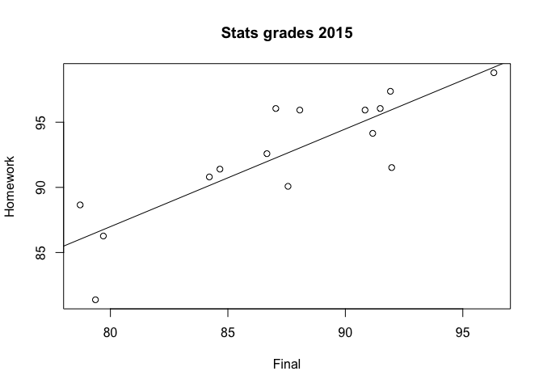
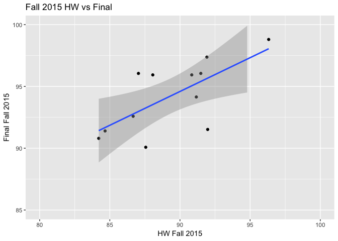

lecture1notes
================
Abby Bergman
1/8/2019

``` r
#load packages
library(tidyverse)
```

    ## ── Attaching packages ────────────────────────── tidyverse 1.2.1 ──

    ## ✔ ggplot2 3.1.0     ✔ purrr   0.2.5
    ## ✔ tibble  1.4.2     ✔ dplyr   0.7.7
    ## ✔ tidyr   0.8.2     ✔ stringr 1.3.1
    ## ✔ readr   1.1.1     ✔ forcats 0.3.0

    ## ── Conflicts ───────────────────────────── tidyverse_conflicts() ──
    ## ✖ dplyr::filter() masks stats::filter()
    ## ✖ dplyr::lag()    masks stats::lag()

``` r
library(ggplot2)
library(readr)
```

``` r
#set wd (only need to do this if not in an .Rmd file)
setwd("/Users/AbigailBergman/Desktop/Grad School/Winter Quarter 2019/Data Science/datascience_repo/week_01")
```

``` r
#load grades csv
grades <- read.csv("Grades.csv")
View(grades)

study_01 <- read.csv("Study1.csv")
View(study_01)
```

``` r
#Descriptive statistics

#mean(df$variable)
mean(grades$HW_F2015, na.rm = TRUE)
```

    ## [1] 92.46489

``` r
#standard deviation
#sd(df$variable)
sd(grades$Final_F2015, na.rm = TRUE)
```

    ## [1] 5.221352

``` r
#summary
summary(grades)
```

    ##    StudentID     HW_F2015      Final_F2015       HW_W2016    
    ##  Min.   : 1   Min.   :81.37   Min.   :78.71   Min.   :84.38  
    ##  1st Qu.: 5   1st Qu.:90.44   1st Qu.:84.44   1st Qu.:93.72  
    ##  Median : 9   Median :92.59   Median :87.56   Median :96.09  
    ##  Mean   : 9   Mean   :92.46   Mean   :87.31   Mean   :95.19  
    ##  3rd Qu.:13   3rd Qu.:95.99   3rd Qu.:91.33   3rd Qu.:97.29  
    ##  Max.   :17   Max.   :98.80   Max.   :96.32   Max.   :99.17  
    ##               NA's   :2       NA's   :2                      
    ##   Final_W2016   
    ##  Min.   :74.60  
    ##  1st Qu.:81.50  
    ##  Median :84.78  
    ##  Mean   :84.57  
    ##  3rd Qu.:88.30  
    ##  Max.   :93.74  
    ## 

``` r
#plots
plot(grades$Final_F2015, grades$HW_F2015, ann = FALSE)
#add line
fit = lm(HW_F2015 ~ Final_F2015, data = grades) #make line equation
fit
```

    ## 
    ## Call:
    ## lm(formula = HW_F2015 ~ Final_F2015, data = grades)
    ## 
    ## Coefficients:
    ## (Intercept)  Final_F2015  
    ##     27.0319       0.7494

``` r
abline(fit) #fit the line
title(main = "Stats grades 2015", #labels
      ylab = "Homework", 
      xlab = "Final")
```



``` r
#ggplot
library(ggplot2)
ggplot(grades, aes(x=Final_F2015, y=HW_F2015)) +
  geom_point() +
  geom_smooth(method = lm) +
  labs(title = "Fall 2015 HW vs Final",y = "Final Fall 2015", x = "HW Fall 2015")+
  ylim(c(85,100))+xlim(c(80,100))
```

    ## Warning: Removed 5 rows containing non-finite values (stat_smooth).

    ## Warning: Removed 5 rows containing missing values (geom_point).



``` r
#correlation

cor.test(grades$Final_F2015, grades$HW_F2015)
```

    ## 
    ##  Pearson's product-moment correlation
    ## 
    ## data:  grades$Final_F2015 and grades$HW_F2015
    ## t = 5.5963, df = 13, p-value = 8.679e-05
    ## alternative hypothesis: true correlation is not equal to 0
    ## 95 percent confidence interval:
    ##  0.5767275 0.9456688
    ## sample estimates:
    ##       cor 
    ## 0.8406361

``` r
#report as: r(13) = 0.84, p<.0001, strong positive correlation
```

``` r
#t test
#paired -> t.test(df$variable1, df$variable2, paired = TRUE)
t.test(grades$HW_W2016, grades$Final_W2016, paired = TRUE)
```

    ## 
    ##  Paired t-test
    ## 
    ## data:  grades$HW_W2016 and grades$Final_W2016
    ## t = 9.7832, df = 16, p-value = 3.723e-08
    ## alternative hypothesis: true difference in means is not equal to 0
    ## 95 percent confidence interval:
    ##   8.321789 12.925913
    ## sample estimates:
    ## mean of the differences 
    ##                10.62385

``` r
#independent t test (Welch's)
t.test(grades$Final_F2015, grades$Final_W2016)
```

    ## 
    ##  Welch Two Sample t-test
    ## 
    ## data:  grades$Final_F2015 and grades$Final_W2016
    ## t = 1.5402, df = 28.715, p-value = 0.1345
    ## alternative hypothesis: true difference in means is not equal to 0
    ## 95 percent confidence interval:
    ##  -0.9016308  6.3916691
    ## sample estimates:
    ## mean of x mean of y 
    ##  87.31163  84.56661

``` r
#independent (student) t test (assumes equal variance)
t.test(grades$Final_F2015, grades$Final_W2016, var.equal = TRUE)
```

    ## 
    ##  Two Sample t-test
    ## 
    ## data:  grades$Final_F2015 and grades$Final_W2016
    ## t = 1.5485, df = 30, p-value = 0.132
    ## alternative hypothesis: true difference in means is not equal to 0
    ## 95 percent confidence interval:
    ##  -0.8754115  6.3654497
    ## sample estimates:
    ## mean of x mean of y 
    ##  87.31163  84.56661
